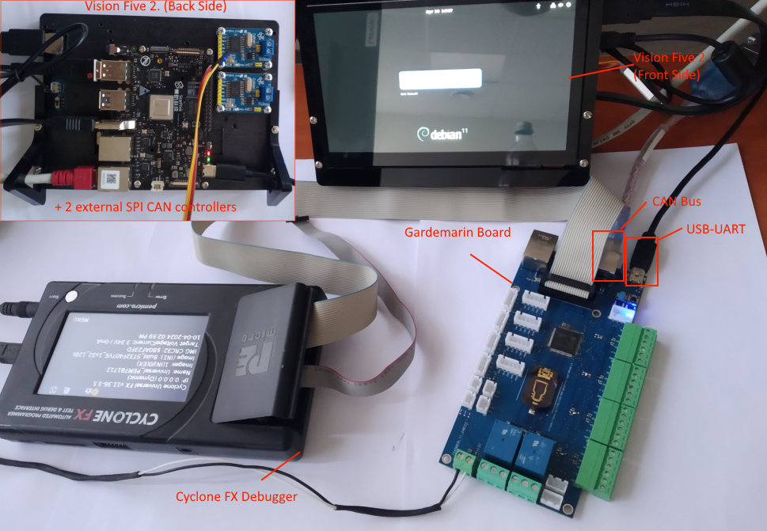

# STM32 Gardemarin

STM32 Gardemarin kit allows users to develop own system with the multiple motors
and sensors controlled by a single board with the Arm Cortex M4F processor.

Please find the brief presentation of the development board [here](docs/Gardemarin_Board.pdf).


Board is capable to control:
 
- Up to 8 motors
- 4 Load cells
- 2 Temperature sensors
- 4 LEDs strip
- CAN and Ethernet
- And some additional option (see presentation)

## Development kit

Full setup includes the following items:

1. Gardemarin (ARM M4F) board
2. Vision Five 2 (RISC-V) Single Board Computer (SBC)
3. Cyclone FX Debugger



Vision Five 2 board provides touch screen controll functions and interacts with the
Gardermarin board mainly through the CAN bus.

## Examples

* Common code reusable by others applications.
* Non-modified Free RTOS source code used by examples running this Operational System
* Simple boot application that allows to initialize system and prints
  'Hello World' into UART
* Application 'app_os_simlpe' implements basic tests of system components (motors, sensors,
  scales etc) and starts Free RTOS scheduler and some testing tasks.
* Automated Aeroponics System with the wide network capability
* Provides additional examples, like:

  - FreeRTOS with the Web server using LwIP TCP/IP stack.
  - CAN over Ethernet 
  - And some other useful examples

## CAN database file (DBC)

All examples in repository providing CAN access contains DBC converter and special SW layer
that allows to interact (read/write) with the object's attributes. List of all registered 
objects and its attributes is output during startup. DBC formatted information could be saved
into the _*.dbc_ file and used by third-party CAN analyzers.

Application startup output example:

```
```
