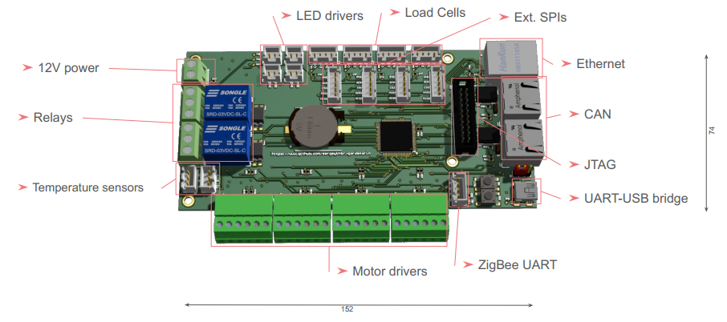

# STM32 Gardemarin

STM32 Gardemarin kit allows users to develop own system with the multiple motors
and sensors controlled by a single board with the Arm Cortex M4F processor.

Please find the brief presentation of the development board [here](docs/Gardemarin_Board.pdf).

Board is capable to control:
 
- Up to 8 motors
- 4 Load cells
- 2 Temperature sensors
- 4 LEDs strip
- CAN and Ethernet
- And some additional option (see presentation)

Current repository intends to implement 

* Automated Aeroponics System with the wide network capability
* Provides additional examples, like:

  - FreeRTOS with the Web server using LwIP TCP/IP stack.
  - CAN over Ethernet 
  - And some other teching materials
