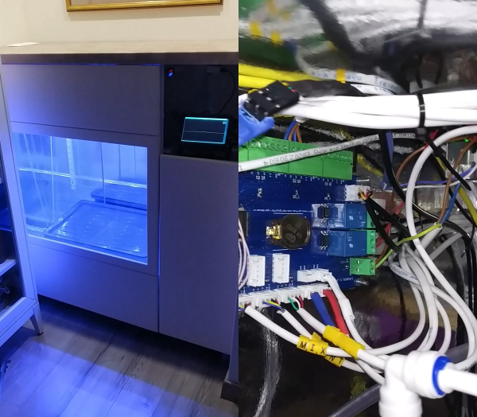

# STM32 Gardemarin

The STM32 Gardemarin kit empowers users to craft their own systems with multiple motors and sensors,
all controlled by a single board featuring the ARM Cortex M4F processor.

Please find the brief presentation of the development board [here](docs/Gardemarin_Board.pdf).

## Key Features
 
* __Versatile Motor and Sensor Control:__ Capable of handling up to 8 motors,
4 load cells, 2 temperature sensors, and 4 LED strips simultaneously.
* __Connectivity Options:__ Equipped with CAN and Ethernet interfaces, facilitating seamless 
communication with external devices.
* __Expandability:__ Additional options are available; refer to the presentation for details.

## Development Kit Components

The complete setup comprises:

1. Gardemarin (ARM M4F) board
2. Vision Five 2 (RISC-V) Single Board Computer (SBC)
3. Cyclone FX Debugger

The Vision Five 2 board complements the Gardemarin by providing touchscreen control
functions and interfacing primarily via the CAN bus.

## Examples

* Common code snippets reusable across applications.
* Non-modified FreeRTOS source code for running the system.
* Boot application initializes the system and prints 'Hello World' via UART
* Application 'app_os_simlpe' implements the basic aeroponic system firmware
  running FreeRTOS scheduler and basic peripheries (motors, sensors, pumps etc).
* QtMonitor host application running on RISC-V Debian computer provides addtional
  funcitonality, like:

  - Camera to capture video stream or photo.
  - Logging and statistic server
  - Doxygen generated documentation

## Assembled Autonomous Aeroponic System

## CAN database file (DBC)

For applications involving CAN access, each example in the repository is accompanied by
a DBC converter and a specialized software layer facilitating interaction (read/write)
with object attributes. During startup, a list of all registered objects and attributes is
provided. This DBC-formatted information can be saved into a _*.dbc_ file for use with third-party
CAN software.

